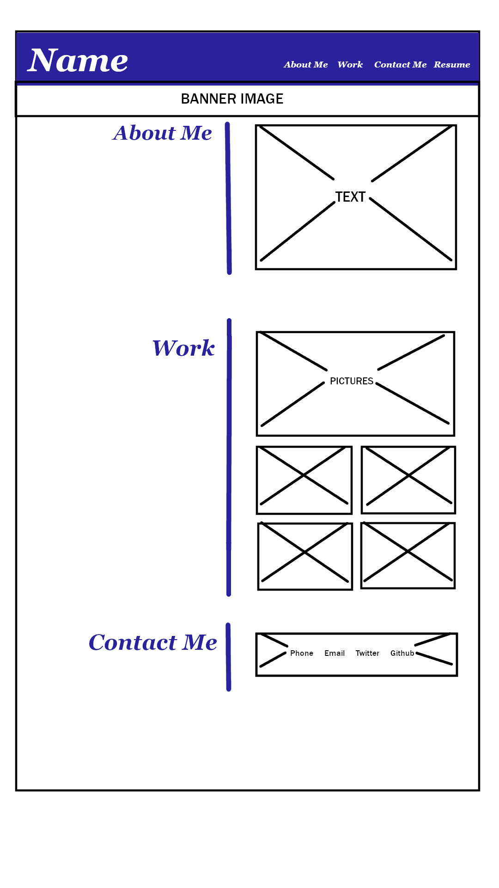
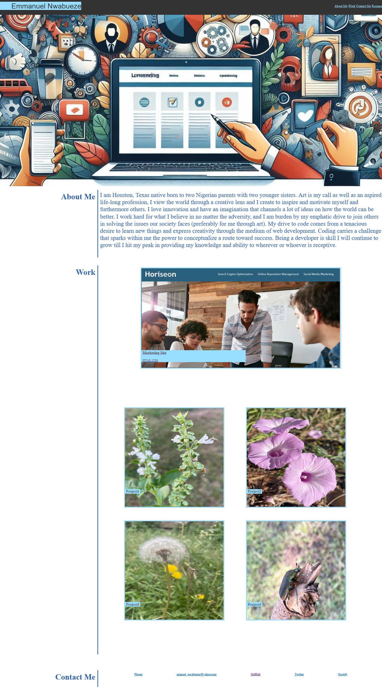

# My BIO & Portfolio

## PURPOSE 

This webpage displays my portfolio, and it is divided into three different sections which are About Me, Work, and Contact Me. Here employers can view more indepth information about myself.


## User Story

```
AS A JOB SEEKER
I WANT to show a potential EMPLOYER a deployed portfolio of work samples
SO THAT the EMPLOYER can review samples of my work and assess whether I am a good candidate for an open position.
```


## Acceptance Criteria

Here are the critical requirements necessary to develop a portfolio that satisfies a typical hiring manager’s needs:

```
GIVEN I need to show a potential Employer previous work
WHEN my portfollio loads
THEN my name is presented and a recent photo of my repo, and links to sections about me, my work, and how to contact me
WHEN one of the links in the navigation is clicked
THEN the UI scrolls to the corresponding section
WHEN the link to the section about my work is clicked 
THEN the UI scrolls to a section with titled images of the my Github repoistory
WHEN the scroll to the first image of my project (Github repoistory) 
THEN that project image should be larger in size than the others
WHEN I click on the images of the applications
THEN I am taken to that deployed application
WHEN I resize the page or view the site on various screens and devices
THEN I am presented with a responsive layout that adapts to my viewport
```
### Wireframe



### Screenshot



### Contact Links

```

* Github - Repository contains quality readme with description, screenshot, link to deployed application.
*Twitter
* Resume - with Employment history and certification
```


